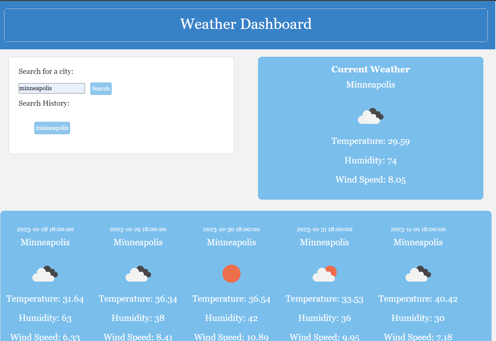

# Weather Forecast

## Description
The motivation to create this application was to create a weather forecast search engine.  When the user searches for a city, the current weather and a 5-day forecast for the searched city will be displayed.  Previously searched cities will appear in their search history list and saved into local storage allowing them to revisit that city's weather easily.  This application uses the OpenWeather API database to fetch current and future weather forecast.  I built this application to practice and apply the skills that I learned about fetching specified data from server-side APIs.  I learned how to concatenate API addresses based on of the documentation and gained future practice writing functions and storing data in local storage.  I've become more proficient and confident creating elements dynamically though Javascript.

## Usage

## Technologies
[OpenWeatherMap API](https://openweathermap.org/api)

## Credits
[MDN Web Docs](https://developer.mozilla.org/en-US/)  
[W3 Schools](https://www.w3schools.com/)

## Code Source
[github](https://github.com/ellacheu/weather-forecast)  
[live link](https://ellacheu.github.io/weather-forecast/)

## License
MIT License

Copyright (c) 2023 elayne

Permission is hereby granted, free of charge, to any person obtaining a copy of this software and associated documentation files (the "Software"), to deal in the Software without restriction, including without limitation the rights to use, copy, modify, merge, publish, distribute, sublicense, and/or sell copies of the Software, and to permit persons to whom the Software is furnished to do so, subject to the following conditions:

The above copyright notice and this permission notice shall be included in all copies or substantial portions of the Software.

THE SOFTWARE IS PROVIDED "AS IS", WITHOUT WARRANTY OF ANY KIND, EXPRESS OR IMPLIED, INCLUDING BUT NOT LIMITED TO THE WARRANTIES OF MERCHANTABILITY, FITNESS FOR A PARTICULAR PURPOSE AND NONINFRINGEMENT. IN NO EVENT SHALL THE AUTHORS OR COPYRIGHT HOLDERS BE LIABLE FOR ANY CLAIM, DAMAGES OR OTHER LIABILITY, WHETHER IN AN ACTION OF CONTRACT, TORT OR OTHERWISE, ARISING FROM, OUT OF OR IN CONNECTION WITH THE SOFTWARE OR THE USE OR OTHER DEALINGS IN THE SOFTWARE.

